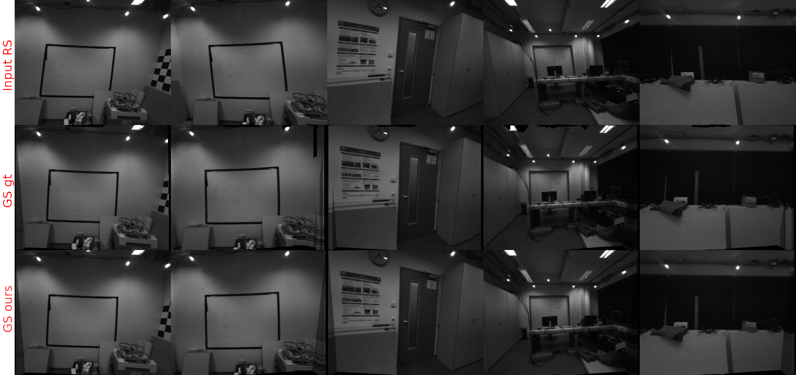
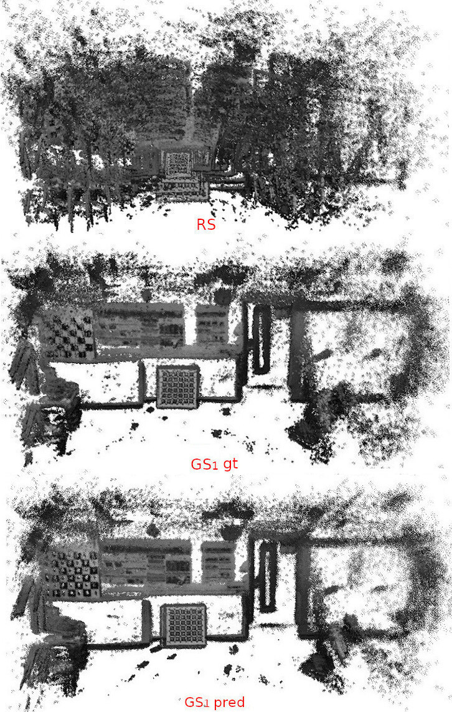

# IMU-Assisted Learning of Single-View Rolling Shutter Correction
Follow the README in *dataset/* for dataset information and in *network/* for network training and testing.

## Samples
 

## DSO on resulting images
 