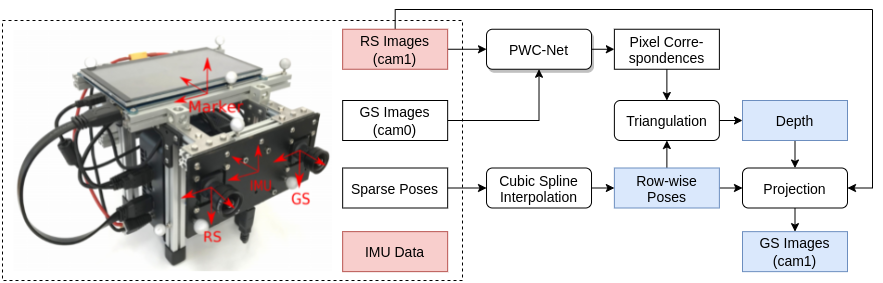

# Dataset Process
* Overview

     

* Usage
    * Option a: Process data from raw TUM dataset.
        * Dependencies (version we use)
            * [numpy(1.17.4)](https://numpy.org/)
            * [cv2](https://pypi.org/project/opencv-python/), [csv](https://docs.python.org/3/library/csv.html), [yaml](https://pyyaml.org/wiki/PyYAMLDocumentation) for reading TUM dataset
            * [Tensorflow(2.3.0)](https://www.tensorflow.org/) for pwcnet
            * [scipy(1.4.1)](https://www.scipy.org/) for pose interpolation
            * [pandas(1.2.3)](https://pandas.pydata.org/) for image post-processing (interpolation)
            * [tqdm](https://pypi.org/project/tqdm/) for progress visualization
        
        * Download [TUM Rolling Shutter Dataset](https://vision.in.tum.de/data/datasets/rolling-shutter-dataset) with Euroc/DSO format, modify **data_path** in **tum_process.py** accordingly.
        * Download [PWC-Net weights](https://drive.google.com/file/d/1hB5nCbBJf6I06dL5VX4aiAdTYUzlLCsi/view?usp=sharing) (thank Igor Slinko for shaing the weights), modify **ckpt_path** in **pwcnet.py** accordingly.
        * Specify **save_path** in **tum_process.py** if needed; otherwise, save to *../data/* by default.
        * Process the dataset.
            ```
            python3 tum_process.py
            ```
    * Option b: Download the [processed data](https://drive.google.com/file/d/16GJnkvVX1t6cU7lUOvpoc8L-cKy-R55-/view?usp=sharing) directly.

# Dataset Format
* Network input:
    * **seq\*/cam1/images/**: input RS images.
    * **seq\*/cam1/imu_cam1_v1.npy**: input row-wise IMU data rotated to cam1 frame, with a shape of [image_count, image_height, 6], the last dimension represents [gryo_x, gryo_y, gryo_z, acc_x, acc_y, acc_z]. 
    * **seq\*/cam1/camera.npy**: global camera intrinsic parameters, [fx, fy, cx, cy]. 
    * **seq\*/cam1/v1_lut.npy**: global lens distortion look-up table, with a shape of [image_height, image_width], the value represents the original scan-line of that pixel.

* Network training ground-truth:
    * **seq\*/cam1/depth/**: depth maps.
    * **seq\*/cam1/flows_rs2gs/**: RS correction flow mapping from RS image to GS image.
    * **seq\*/cam1/pose_cam1_v1.npy**: row-wise pose for cam1, with a shape of [image_count, image_height, 6], the last dimension represents [t_x, t_y, t_z, r_x, r_y, r_z], the rotation uses angle-axis representation.

* Other data for testing:
    * **seq\*/cam1/images_gs/**: ground-truth GS images. 
    * **seq\*/cam1/pose_w_cam1.txt**: ground-truth pose of cam1 in world frame, with a shape of [image_count, 8], the last dimension represents [image_index, t_x, t_y, t_z, q_x, q_y, q_z, q_w], the rotation uses quaternion representation; we use it to benchmark visual SLAM systems on resulting images.

# Code Citations
* The implementation of PWC-Net in this work (**pwcnet.py**) is written by [Phil Ferriere](https://github.com/philferriere/tfoptflow/blob/master/tfoptflow/model_pwcnet.py).