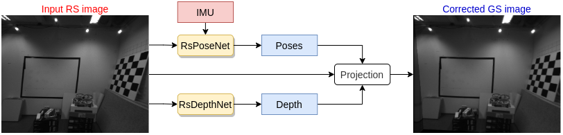
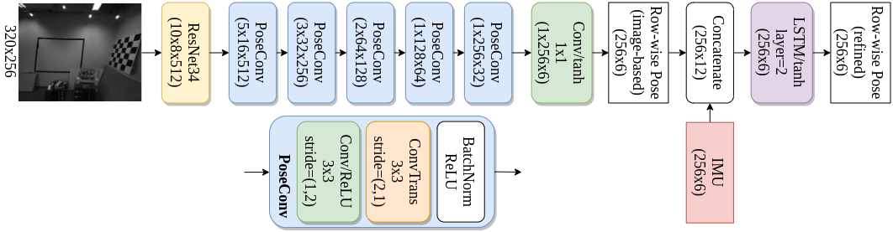

# Network
* Overview

     
* **RsPoseNet**

     

# Files
* **DataLoader.py** loads the dataset, remember to modify the **data_path** in this file to the processed dataset.
* **RsDepthNet.py** and **train_rsdepthnet.py** is the implementation of RsDepthNet.
* **RsPoseNet.py** and **train_rsposenet.py** is the implementation of the proposed RsPoseNet.
* **test.py** calculates the EPE and Improvement Ratio, as well as rectifies images.

# Usage
* Dependencies (version we use)
    * [numpy(1.17.4)](https://numpy.org/)
    * [cv2](https://pypi.org/project/opencv-python/) for reading images
    * [Tensorflow(2.3.0)](https://www.tensorflow.org/), [Keras(2.4.3)](https://keras.io/), [classification-models(*ResNet34*)](https://github.com/qubvel/classification_models) for network structure
    * [pandas(1.2.3)](https://pandas.pydata.org/) for image post-processing (interpolation)

* Training
    ```
    python3 train_rsdepthnet.py
    python3 train_rsposenet.py
    ```
    or download the our trained [checkpoints](https://drive.google.com/file/d/1CMi2j5-aU4YCWay3ebMWkr3ClFqPsSSs/view?usp=sharing).

* Testing
    ```
    python3 test.py
    ```
    the recitified images are saved to *./results/*.